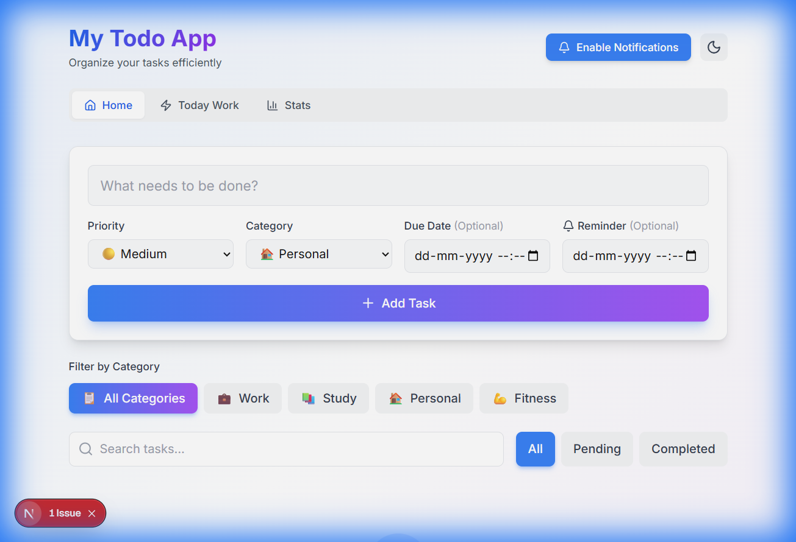

# My Todo App 🚀

A modern, high-performance Todo application built with **Next.js**, **Tailwind CSS**, and **TypeScript**. Stay organized, track your daily focus, and visualize your productivity with ease.



## ✨ Features

- **✅ Smart Task Management**: Add tasks with priority levels, categories, and due dates.
- **📅 Daily Focus**: A dedicated workspace to stay focused on today's most important work.
- **📊 Productivity Stats**: Visualize your progress with interactive charts (Coming Soon).
- **🔔 Reminders**: Never miss a deadline with built-in notification support.
- **🌓 Dark Mode**: Seamlessly switch between light and dark themes.
- **📱 Responsive Design**: Optimized for all devices, from desktop to mobile.

## 🛠️ Tech Stack

- **Framework**: [Next.js](https://nextjs.org/) (App Router)
- **Styling**: [Tailwind CSS](https://tailwindcss.com/)
- **Language**: [TypeScript](https://www.typescriptlang.org/)
- **Icons**: Lucide React
- **Notifications**: Custom Hook integration

## 🚀 Getting Started

First, install the dependencies:

```bash
npm install
```

Then, run the development server:

```bash
npm run dev
```

Open [http://localhost:3000](http://localhost:3000) with your browser to see the result.

## 📂 Project Structure

- `app/`: Next.js App Router pages and layouts.
- `components/`: Reusable UI components.
- `hooks/`: Custom React hooks for state and notifications.
- `utils/`: Utility functions and constants.
- `public/`: Static assets including screenshots.

## 📄 License

This project is open-source and available under the MIT License.

---
Built with ❤️ by [TAUFIQ RAZA](https://github.com/TAUFIQ-RAZA)
